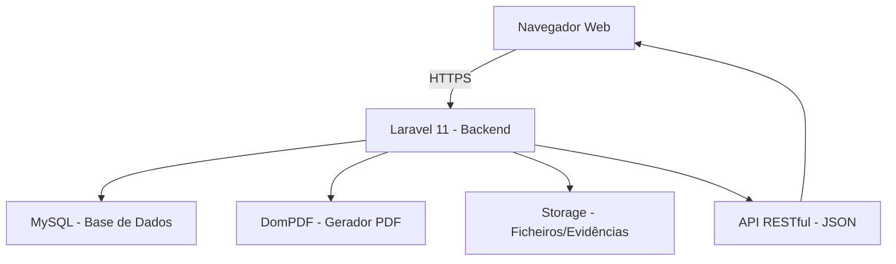

# 🇦🇴 SISTEMA DE COMANDO E GESTÃO DE DADOS — COMANDO MUNICIPAL DE VIANA

## RELATÓRIO DE APRESENTAÇÃO DO PROJECTO

**Entidade:** Polícia Nacional — Comando Municipal de Viana  
**Província:** Luanda, Angola  
**Versão:** 1.0  
**Data:** Abril de 2026  

---

## PARTE I — APRESENTAÇÃO EXECUTIVA (2 minutos)

### O Problema

O Comando Municipal de Viana enfrenta desafios operacionais que impactam directamente a segurança pública e a eficiência institucional:

- **Registos em papel** — Ocorrências, detenções e processos registados manualmente, sujeitos a perda, deterioração e duplicação de dados.
- **Falta de rastreabilidade** — Impossibilidade de acompanhar o ciclo de vida completo de uma ocorrência, desde o registo até à remessa ao Ministério Público.
- **Comunicação fragmentada** — Informações dispersas entre esquadras e postos policiais, sem visão centralizada do panorama criminal.
- **Ausência de indicadores** — Decisões operacionais tomadas sem dados estatísticos actualizados sobre criminalidade, recursos e desempenho.

### A Solução

O **SCGD — Sistema de Comando e Gestão de Dados** é uma plataforma digital integrada, desenvolvida especificamente para a realidade operacional da Polícia Nacional de Angola, que digitaliza **todo o fluxo operacional** do Comando Municipal de Viana.

### Resultados Esperados

| Indicador | Antes | Com o SCGD |
|---|---|---|
| Tempo de registo de ocorrência | 30–45 min (papel) | **3–5 min** (digital) |
| Localização de processos | Horas/dias | **Segundos** (busca instantânea) |
| Relatórios estatísticos | Manual (dias) | **Automático** (tempo real) |
| Rastreabilidade de evidências | Inexistente | **Cadeia de custódia digital** |
| Coordenação entre esquadras | Por telefone/rádio | **Centralizada em tempo real** |
| Remessa ao MP | Papel físico | **Processo digital com PDF** |

> **Em resumo:** O SCGD transforma o Comando Municipal de Viana numa instituição moderna, eficiente e transparente, alinhada com as melhores práticas internacionais de gestão policial.

---

## PARTE II — APRESENTAÇÃO COMPLETA DO SISTEMA

---

### 1. ARQUITECTURA TECNOLÓGICA

| Componente | Tecnologia | Justificação |
|---|---|---|
| **Backend** | PHP 8.2 / Laravel 11 | Framework robusto, seguro, com ecossistema maduro |
| **Base de Dados** | MySQL 8.0 | Relacional, transaccional, auditável |
| **Frontend** | HTML5 / CSS3 / JavaScript | SPA dinâmica sem dependências pesadas |
| **PDF** | DomPDF | Geração de fichas e relatórios oficiais |
| **Autenticação** | Laravel Sanctum | Sessões seguras com CSRF e middleware |

### 2. CONTROLO DE ACESSO (RBAC)

O sistema implementa **Controlo de Acesso Baseado em Perfis**, garantindo que cada utilizador acede apenas às funcionalidades e dados que lhe competem.

| Perfil | Visibilidade | Funcionalidades |
|---|---|---|
| **Administrador** | Global | Tudo: gestão de utilizadores, configurações, logs |
| **Comandante** | Global | Operacional completo, relatórios, despachos |
| **Chefe de Esquadra** | Unidade | Ocorrências, detenções, patrulhas, relatórios da unidade |
| **Investigador** | Casos atribuídos | Investigações, notas, evidências |
| **Agente** | Registos próprios | Ocorrências próprias, detenções próprias |
| **Operador** | Registos próprios | Registo de ocorrências, consulta |

> Cada acção no sistema é **registada em log de auditoria**, garantindo total rastreabilidade e conformidade legal.

---

### 3. MÓDULOS DO SISTEMA

---

#### 3.1 📊 Dashboard — Painel de Controlo

O ecrã principal apresenta uma **visão operacional em tempo real** com:

- **7 indicadores-chave**: Ocorrências totais, Casos Abertos, Resolvidos, Detenções (mês), Investigações activas, Processos Criminais activos, Alertas
- **Gráficos**: Crimes por tipo e crimes por mês (ano corrente)
- **Últimas ocorrências**: Lista das 10 ocorrências mais recentes com acesso directo

Os stat cards são **interactivos** — clicando em "Investigações" ou "Processos Activos", o utilizador navega directamente para a respectiva secção.

---

#### 3.2 📋 Ocorrências

Módulo central do sistema. Gere todo o ciclo de vida de uma ocorrência criminal.

**Funcionalidades:**
- Registo completo: tipo de crime, prioridade, local, bairro, descrição detalhada
- Classificação por categorias de crime (Angola)
- Atribuição de agente responsável por unidade
- Estados progressivos: Registada → Em Análise → Em Investigação → Resolvida → Arquivada
- Adição de envolvidos (Suspeito, Vítima, Testemunha)
- Evidências com upload de ficheiros
- Vista detalhada com todos os dados relacionados
- Exportação PDF — Ficha de Ocorrência oficial

**Filtros:** Busca textual, estado, prioridade, tipo de crime, datas, unidade

---

#### 3.3 ⚖️ Processos Criminais

Módulo de gestão de processos para remessa ao **Ministério Público** — o fluxo legal pós-investigação.

**Funcionalidades:**
- Abertura de processo a partir de uma ocorrência
- Numeração automática sequencial (PC-AAAA-XXXXX)
- Fluxo de estados legais:
  - **Em Instrução** → recolha de provas e diligências
  - **Concluído** → instrução finalizada
  - **Remetido ao MP** → com destino de remessa (ex: Procuradoria Municipal de Viana)
  - **Arquivado** → com parecer final
- Vista detalhada: dados do processo, ocorrência associada, envolvidos, detenções, evidências, investigações
- Campo de parecer final para fundamentação da decisão
- Destino de remessa configurável
- Processo confidencial (flag)
- Exportação PDF — Ficha de Processo Criminal

**Impacto Legal:** Garante a conformidade com os procedimentos do Código de Processo Penal angolano, assegurando que nenhum processo se perde e que a cadeia documental é mantida.

---

#### 3.4 👥 Pessoas

Base de dados centralizada de todas as pessoas envolvidas em ocorrências.

**Dados registados:** Nome, BI, sexo, data de nascimento, nacionalidade, telefone, morada, bairro, alcunha, características físicas

**Funcionalidades:**
- Registo e consulta
- Histórico completo de envolvimentos em ocorrências
- Histórico de detenções
- Criação rápida durante o registo de ocorrência

---

#### 3.5 🔒 Detenções

Gestão de todo o processo de detenção, desde a captura ao julgamento.

**Funcionalidades:**
- Registo com dados do detido, ocorrência, data/hora, local, motivo
- Numeração automática (DT-AAAA-XXXXX)
- Estados: Em Custódia → Apresentado ao MP → Julgado → Libertado → Transferido
- Vista detalhada completa
- Filtros por estado, unidade, datas
- Exportação PDF

---

#### 3.6 📦 Cofre de Evidências

Repositório digital e físico de evidências, com **cadeia de custódia** integrada.

**Funcionalidades:**
- Registo com tipo (Fotos, Vídeos, Documentos, Áudio, Físicos)
- Upload de ficheiros digitais (até 50 MB)
- **Visualizador inline** — pré-visualizar imagens, vídeos, áudio e PDFs sem descarregar
- Hash SHA-256 para integridade digital
- Cadeia de custódia com transferências registadas (quem, quando, de onde, para onde)
- Grid visual com cards por tipo
- Busca por código ou descrição

**Segurança:** O hash criptográfico garante que o ficheiro não foi alterado após o registo, essencial para validade legal da evidência.

---

#### 3.7 🔍 Investigações

Módulo completo de gestão de processos investigativos.

**Funcionalidades:**
- Abertura de investigação a partir de ocorrência
- Atribuição de investigador responsável
- Barra de progresso (0–100%)
- Estados: Aberta → Em Curso → Suspensa → Concluída
- **Notas de investigação** — diário de diligências com título, conteúdo, data e autor
- Vista detalhada com ocorrência, envolvidos, evidências (com viewer)
- Filtros por estado, unidade, datas
- Paginação
- Exportação PDF — Ficha de Investigação

---

#### 3.8 📨 Despachos

Sistema de ordens e atribuições entre superiores hierárquicos e agentes.

**Funcionalidades:**
- Criação de despacho vinculado a ocorrência
- Prioridade e instrução
- Estados: Pendente → Aceite → Executado
- Aceitação pelo agente destinatário

---

#### 3.9 🚔 Patrulhas

Gestão operacional de patrulhas no terreno.

**Funcionalidades:**
- Planeamento com zona, turno, agente líder e viatura
- Estados: Planeada → Em Curso → Concluída
- Registo de incidentes durante a patrulha
- Filtros por data, estado e unidade

---

#### 3.10 🔔 Alertas

Sistema de notificações e alertas operacionais.

**Funcionalidades:**
- Criação com tipo, prioridade e descrição
- Estados: Activo → Resolvido
- Contagem no dashboard e ícone de notificação no header

---

#### 3.11 🚗 Viaturas

Gestão de frota de viaturas policiais.

**Funcionalidades:**
- Registo: matrícula, marca, modelo, ano, cor, quilometragem
- Estados: Disponível, Em Uso, Manutenção
- Atribuição a agente com km de saída e retorno
- Histórico completo de atribuições
- Filtros por estado, busca e unidade

---

#### 3.12 🔫 Armamento

Controlo rigoroso do arsenal policial.

**Funcionalidades:**
- Registo: número de série, tipo, marca, modelo, calibre
- Atribuição a agente com datas e estado
- Histórico de atribuições completo
- Estados: Disponível, Atribuído, Manutenção
- Filtros por tipo, estado, busca e unidade

---

#### 3.13 💬 Mensagens

Comunicação interna entre agentes do sistema.

**Funcionalidades:**
- Envio e recepção de mensagens
- Prioridade (Normal/Urgente)
- Indicador de mensagens não lidas

---

#### 3.14 📈 Relatórios

Geração automática de relatórios operacionais e estatísticos.

**Funcionalidades:**
- Tipos de relatório configuráveis
- Período de análise (data início/fim)
- Filtro por unidade
- Histórico de relatórios gerados
- Exportação PDF

---

#### 3.15 🛡️ Administração

Ferramentas exclusivas do administrador do sistema.

- **Gestão de Identidade** — criação e gestão de utilizadores, perfis, patentes
- **Configurações** — parâmetros do sistema (nome da entidade, etc.)
- **Logs de Auditoria** — registo de todas as acções (quem fez, o quê, quando)

---

#### 3.16 🌐 Portal do Cidadão

Interface pública para participação cidadã.

**Funcionalidades:**
- Submissão de queixas online
- Consulta do estado da queixa por protocolo
- Conversão de queixa em ocorrência (pelo operador)

---

### 4. EXPORTAÇÃO PDF

O sistema gera **fichas oficiais em formato PDF** para todos os documentos críticos:

| Documento | Conteúdo |
|---|---|
| **Ficha de Ocorrência** | Dados completos, envolvidos, evidências |
| **Ficha de Detenção** | Dados do detido, motivo, estado |
| **Ficha de Processo Criminal** | Processo completo, ocorrência, envolvidos, detenções, evidências, investigações |
| **Ficha de Investigação** | Dados da investigação, ocorrência, notas |
| **Relatório de Criminalidade** | Estatísticas agregadas |
| **Lista de Agentes** | Efectivo activo |
| **Relatório de Alertas** | Alertas do sistema |

Todos os PDFs incluem: cabeçalho institucional "República de Angola — Polícia Nacional", data de geração e nome do utilizador que gerou.

---

## PARTE III — RESULTADOS ESPERADOS PARA O COMANDO MUNICIPAL DE VIANA

---

### Resultados Operacionais Imediatos (0–3 meses)

| Área | Resultado Esperado |
|---|---|
| **Registo de ocorrências** | Redução de 80% no tempo de registo (de 30 min para 5 min) |
| **Busca de informações** | De horas/dias para segundos — busca instantânea por nome, BI, número |
| **Coordenação** | Visão centralizada de todas as ocorrências de todas as esquadras |
| **Despachos** | Atribuição e acompanhamento digital de ordens |
| **Comunicação** | Mensagens internas substituem telefonemas e papéis |

### Resultados Estratégicos (3–12 meses)

| Área | Resultado Esperado |
|---|---|
| **Análise criminal** | Dashboard com indicadores em tempo real para apoio à decisão |
| **Prevenção** | Identificação de padrões criminais por tipo, local e período |
| **Recursos** | Controlo preciso de viaturas e armamento — redução de desperdício |
| **Reincidência** | Base de dados de pessoas permite identificar suspeitos reincidentes |
| **Remessa ao MP** | Processos criminais organizados, completos e rastreáveis |

### Resultados Institucionais (12+ meses)

| Área | Resultado Esperado |
|---|---|
| **Transparência** | Logs de auditoria completos — rastreabilidade total |
| **Credibilidade** | Documentação profissional para o Ministério Público |
| **Eficiência** | Libertação de recursos humanos ocupados com burocracia |
| **Modernização** | Posiciona Viana como referência na modernização policial |
| **Participação cidadã** | Portal de queixas online aumenta confiança da comunidade |

---

## PARTE IV — RECOMENDAÇÕES

---

### 1. Recomendações de Implementação

#### 🔵 Formação
- **Formação inicial** de 2 dias para todos os utilizadores
- Criar um utilizador por agente — nunca partilhar credenciais
- Designar um **administrador do sistema** e um **substituto**
- Manual de utilizador simplificado por perfil (agente, chefe, investigador)

#### 🔵 Infra-Estrutura
- Servidor dedicado (mínimo 8 GB RAM, SSD 256 GB) na rede interna do Comando
- Rede Wi-Fi segura em todas as esquadras e postos
- Backup automático diário da base de dados
- UPS para garantir continuidade energética do servidor

#### 🔵 Dados Iniciais
- Inserir todas as unidades policiais activas (esquadras e postos)
- Configurar os bairros actualizados do município de Viana
- Criar os perfis de utilizador para todos os agentes
- Definir os tipos de crime mais comuns do município

### 2. Recomendações de Segurança

| Medida | Prioridade |
|---|---|
| Alterar palavras-passe a cada 90 dias | Alta |
| Backups automáticos diários (base de dados + ficheiros) | Crítica |
| Acesso ao servidor limitado ao administrador | Crítica |
| HTTPS obrigatório em produção | Alta |
| Revisão periódica de logs de auditoria | Média |
| Processos confidenciais apenas visíveis a quem criou/é responsável | Alta |

### 3. Recomendações de Evolução Futura

| Funcionalidade | Descrição | Prioridade |
|---|---|---|
| **Geolocalização** | Marcar ocorrências no mapa do município | Alta |
| **App Mobile** | Registo de ocorrências no terreno via smartphone | Alta |
| **Módulo de Mandados** | Gestão de mandados de captura e busca | Média |
| **Integração SIC** | Troca de dados com o Serviço de Investigação Criminal | Média |
| **Biometria** | Identificação de detidos por impressão digital | Baixa |
| **Dashboard Público** | Estatísticas de criminalidade abertas ao cidadão | Média |
| **Multi-município** | Expansão para outros comandos municipais | Baixa |
| **Notificações Push** | Alertas em tempo real no browser | Baixa |

---

## PARTE V — DADOS TÉCNICOS

### Estrutura da Base de Dados

O sistema conta com **51 modelos de dados** interligados, cobrindo:

| Domínio | Entidades |
|---|---|
| **Criminal** | Ocorrência, TipoCrime, CategoriaCrime, ProcessoCriminal |
| **Pessoas** | Pessoa, EnvolvimentoOcorrência, TipoEnvolvimento |
| **Detenção** | Detenção, EstadoDetenção |
| **Evidências** | Evidência, TipoEvidência, CadeiaCustódia |
| **Investigação** | Investigação, NotaInvestigação, EstadoInvestigação |
| **Operacional** | Patrulha, PatrulhaIncidente, Zona, ZonaPatrulha, Turno, EscalaTurno |
| **Despacho** | Despacho |
| **Recursos** | Viatura, ViaturaAtribuição, ViaturaManutençao, Armamento, ArmamentoAtribuição |
| **Comunicação** | Mensagem, Notificação, Alerta, AlertaDestinatário, TipoAlerta |
| **Institucional** | Unidade, TipoUnidade, Agente, Patente, Bairro |
| **Autenticação** | User, Perfil, Permissão |
| **Sistema** | Log, HistóricoAlteração, Configuração, Relatório, TipoRelatório, Mandado |
| **Cidadão** | QueixaCidadão |

### API RESTful

O sistema expõe **mais de 60 endpoints** organizados por recurso, incluindo:
- CRUD completo para todas as entidades
- Endpoints de acção (aceitar despacho, resolver alerta, transferir custódia)
- Endpoints de exportação PDF
- Endpoint público para o portal do cidadão

---

## PARTE VI — CONCLUSÃO

O **SCGD — Sistema de Comando e Gestão de Dados** representa uma transformação fundamental na forma como o Comando Municipal de Viana opera. Ao digitalizar processos que anteriormente dependiam de papel, comunicação verbal e memória individual, o sistema:

1. **Elimina a perda de informação** — todos os dados ficam permanentemente registados e pesquisáveis
2. **Acelera a operação** — o que antes levava horas, agora leva minutos
3. **Garante conformidade legal** — processos criminais rastreáveis do registo à remessa ao MP
4. **Apoia a tomada de decisão** — dashboard com indicadores em tempo real
5. **Aumenta a transparência** — logs de auditoria e cadeia de custódia digital
6. **Moderniza a instituição** — posiciona Viana na vanguarda da polícia digital em Angola

> **O SCGD não é apenas um sistema informático — é uma ferramenta de transformação institucional que coloca a Polícia Nacional de Viana ao nível das melhores práticas internacionais de gestão policial.**

---

**Desenvolvido para o Comando Municipal de Viana — Polícia Nacional de Angola**  
**Sistema de Comando e Gestão de Dados (SCGD) — v1.0 — Abril 2026**
